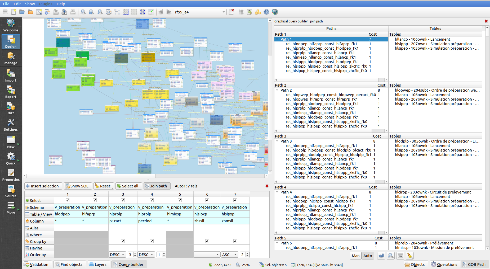
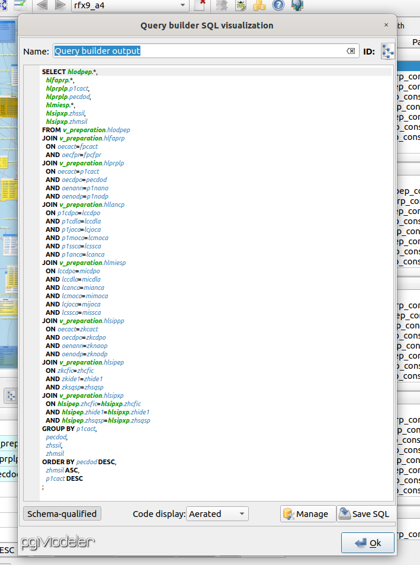

A plugin for [Pgmodeler](https://www.pgmodeler.io), the ERD tool for Postgresql.

This is still alpha, expect bugs, and please help fix them reporting at [github](https://github.com/pgmodeler/plugins/issues).

# Description

pgModeler has reached a certain level of maturity.

While it has grown into a good database management software, it focuses primarily on conception and modelling, with its mastery of the Data Definition Language SQL subset, which help database architects get to a rigorous implementation.

This plugins gives a shot at the Data Query Language SQL subset.
It is aimed primarily at :
 - database analysts, IT or business advisors whom do not have high SQL skills. It may allow them to create queries from visual objects, and help them get on-board with SQL basics along the way.
 - folks with advanced SQL skills whom frequently write long, tedious and repetitive queries for their applications.




# Features
### Create SQL queries graphically.

[](http://www.youtube.com/watch?v=6e66-fNhvAY "")

This is the traditional feature set, you can insert tables, columns, relations in the builder, group, sort them...

The plugin will then output the SQL, and allow you to save the code, or run it directly from the management section.

### Automatic-join mode.

[](http://www.youtube.com/watch?v=_5QNFXA03Y4 "")

This is a primer in the FLOSS world!
You get candidate join paths, ranked by score, for the items you inserted in the "SELECT" clause of the query.
This can prove useful in discovering a new database, previously reverse-engineered from production (pgModeler can do that !).
To be of any interest, the database and/or the model shall have foreign-key relationships declared. Otherwise, you can beforehand look at tools such as [linkifier](https://github.com/janmotl/linkifier).

This graphical query builder relies on graph algorithms, mainly Dijkstra's path-finding and Dreyfus-Wagner for Steiner trees. See the video above for more details.
Some [implementation research history](https://stackoverflow.com/questions/56193619/what-is-needed-to-use-bgl-algorithms-on-existing-data-structures-edges-and-ver).

Beware that for large models, or numerous columns selected, the solver can turn your computer into a heat machine and hang for a while!

A few white papers about SQL-join solvers :
- http://resources.mpi-inf.mpg.de/yago-naga/naga/download/ICDEResearchLong09_264.pdf
- https://www.ics.uci.edu/~chenli/pub/sigmod2009-tastier.pdf
- https://researcher.watson.ibm.com/researcher/files/in-diptsaha/sap-nlq.pdf
- http://www.vldb.org/pvldb/vol6/p1222-guerra.pdf
- https://www.microsoft.com/en-us/research/wp-content/uploads/2016/02/icde07steiner.pdf

# Installation
Run the setup.sh shell script. It will download the plugin dependencies, [Paal](http://paal.mimuw.edu.pl/) and [Boost](https://www.boost.org/) recursively (expect tons of MBs of network usage...), and will configure Qt build system for the plugin.

`./setup.sh`

Move then the graphicalquerybuilder directory in the pgmodeler source tree, in its plugin directory.
Finally compile pgmodeler, referring to the [installation documentation](https://www.pgmodeler.io/support/installation).

Building the whole pgModeler project from scratch, on a GNU/Linux station, should work with :
```git clone https://www.github.com/pgmodeler/pgmodeler
cd pgmodeler
INSTALLATION_ROOT=$PWD "or wherever out-of-tree you want to"
git clone https://www.github.com/pgmodeler/plugins
cd plugins/graphicalquerybuilder
./setup.sh
cd ../..
QT_ROOT= "type your Qt path here, where bin and include folders are"
$QT_ROOT/bin/qmake -r CONFIG+=release PREFIX=$INSTALLATION_ROOT BINDIR=$INSTALLATION_ROOT \
     PRIVATEBINDIR=$INSTALLATION_ROOT PRIVATELIBDIR=$INSTALLATION_ROOT/lib pgmodeler.pro
make -j"enter CPU cores here" && make install
```

# Contributing

_UI translations_ are appreciated, and you can help on [plenty other topics](https://github.com/pgmodeler/plugins/graphicalquerybuilder/CONTRIBUTING.md).

# Authors

 * **Maxime Chambonnet** - *Initial work*

See also the list of [contributors -soon you hopefully ? :)](https://github.com/pgmodeler/plugins/contributors) who participated in this project.

Thank you to Raphael Araújo e Silva, the author of pgModeler, for his great software that made this feature possible!

Enjoy!
